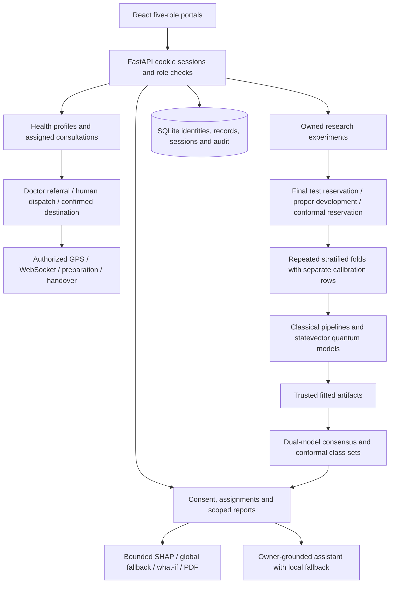

# Qura — Medical Research and Connected Emergency Coordination

Qura v3 is a working research and emergency-coordination prototype with navy and teal patient, doctor, administrator, ambulance-driver and receiving-hospital portals. React/TypeScript connects to a modular FastAPI backend, SQLite, scikit-learn and an exact NumPy quantum simulator. Use public, anonymized or synthetic data only. Results are **not diagnoses, treatment advice, clinical validation or proof of quantum advantage**.

## Run locally

Use Python 3.10 and Node 22.12 or newer. From this folder:

```powershell
npm ci
python -m pip install -r backend/requirements.lock
Copy-Item .env.example .env
```

If `.env` already exists, keep your existing local settings. Set `QURA_JWT_SECRET` to a random secret with at least 32 characters, and set a unique `QURA_DEMO_PASSWORD` with uppercase/lowercase letters, a digit, a symbol and at least 12 characters. Never commit `.env`.

```powershell
python -m backend.seed_demo --train --reports
npm run dev
```

Open http://localhost:3000. Emergency-only demos do not need trained models: run `python -m backend.seed_demo` without `--train --reports`. API documentation is at http://localhost:5000/docs. The seed command trains all six models with the recorded 5-fold, two-repeat configuration on the public Cleveland Heart benchmark and creates three fictional reports. It does not copy patient measurements into demo profiles. Account creation is idempotent; `--train` deliberately creates another experiment. `--quick` creates a reduced two-model smoke run, which must not be described as the complete benchmark.

### Demo accounts

| Role | Email | Access |
| --- | --- | --- |
| Admin | `admin@qura.demo` | Doctor approval, assignments, dispatch, fleet/hospital setup, audit and research |
| Doctor | `doctor1@qura.demo` | Synthetic participants 1 and 2 |
| Doctor | `doctor2@qura.demo` | Synthetic participant 3 |
| Patient | `patient1@qura.demo` | Own fictional reports and history |
| Patient | `patient2@qura.demo` | Own fictional reports and history |
| Patient | `patient3@qura.demo` | Own fictional reports and history |
| Driver | `driver1@qura.demo`, `driver2@qura.demo` | Assigned ambulance dispatch, pickup, location, destination request and handover |
| Hospital | `hospital1@qura.demo`, `hospital2@qura.demo`, `hospital3@qura.demo` | Own capacity, selected referrals, acceptance, preparation and admission |

Each uses your private `QURA_DEMO_PASSWORD`. Existing accounts keep their existing password when the seed runs again. Demo consent is granted only for the explicitly fictional profiles. A real signup starts without consent. Doctor self-signups remain pending administrator approval; admin creation is available only through the trusted seed, not public registration.

## Connected care and emergency workflow

Patient health profile and sharing consent → assigned doctor consultation → human emergency outcome → referral → administration verification → ambulance assignment → driver acceptance and pickup → suitable hospital request → hospital acceptance and bed reservation → live tracking/preparation → arrival confirmation → handover → admission and closure.

Routes, traffic predictions, units and hospital capacity are clearly labeled synthetic/manual prototype information. No real ambulance or hospital system is contacted. Driver browser GPS is optional and enabled only by the driver. The workflow does not require clinical models or the assistant. See [FEATURES.md](docs/FEATURES.md) for the requirement matrix, full five-role walkthrough, simulation boundaries and deployment prerequisites.

Driver/hospital signup is restricted to administrator provisioning under **Fleet & hospitals**. Choose **Ambulance driver** or **Receiving hospital** on the login screen. The first demo hospital has no beds and is excluded; B/C require receiving-staff acceptance before departure. Hospitals update current free capacity under **Hospital capacity**.

## Demo walkthrough

1. Patient: sign in, inspect Consent, open Measurements, fill synthetic demo values and create a report. Select a trained dataset; the complete seed supplies a calibrated pair for Heart. Report creation without consent is rejected.
2. Open My reports, inspect the plain-language summary and both model estimates, download a patient PDF, then explore What-if lab. Inputs represent the benchmark schema, not a validated clinical questionnaire.
3. Open Assistant or the floating widget. Local guidance is labeled when external AI is disabled. Chat history belongs only to the current account and can be deleted.
4. Doctor: sign in through Doctor Portal, inspect assigned participants, open Review queue, add a note and approve or record an explicit override. Model probabilities remain unchanged.
5. Open Consensus Lab for held-out agreement/error association. Research tools provides datasets, preprocessing, training, CV summaries, final-test metrics, calibration curves and batch predictions.
6. Admin: use Administrator sign in, approve pending doctors, assign approved doctors to patients and inspect append-only audit metadata.

## Architecture



| Module | Responsibility |
| --- | --- |
| `backend/emergency.py` | Profiles, consultations, fleet, hospital capacity, guarded dispatch, synthetic routes, GPS, WebSockets and admission |
| `backend/auth.py`, `clinical.py` | Argon2, JWT/refresh cookies, revocation, roles, assignments, consent and audit |
| `backend/evaluation.py`, `quantum.py` | Train-only transforms, calibration, repeated CV, conformal calibration, exact kernels/VQC |
| `backend/consensus.py`, `reports.py` | Matched model pair, uncertainty and audience-specific scoped reports |
| `backend/explain.py`, `whatif.py`, `pdf_export.py` | Row attribution, explicit fallback, bounded experiments and authorized PDFs |
| `backend/chatbot.py`, `i18n/` | Provider adapter, language routing, guards and owner history |
| `backend/settings.py`, `repository.py` | Environment settings and shared storage abstraction |
| `src/PortalApp.tsx`, `src/research/` | Protected portal views, report/review forms, chat, i18n and what-if |
| `src/ResearchApp.tsx` | Existing science workflow with new evaluation controls and evidence |

Legacy `src/CampusApp.tsx`, campus components/context/services and their 28 regression tests remain untouched. Vite proxies `/api`, including WebSocket upgrades, to the backend. `npm run build` creates `dist`; FastAPI serves it when present. Runtime CSV/joblib files and `research.db` are under `QURA_STORAGE_DIR`, default `backend/storage`.

## Methodology and honest results

Public benchmarks: Wisconsin Breast Cancer (569 rows, 30 features), UCI Cleveland Heart (303 rows, 13 features), and UCI Parkinsons Voice (195 rows, 22 features). See `backend/bundled/README.md` for provenance. Parkinsons contains repeated subject recordings: **subject-grouped validation is required** before any performance interpretation beyond workflow demonstration.

Uploads require 30–10,000 rows, 2 target classes with at least 5 examples each, at most 200 columns and a 10 MB size limit. Exact duplicates are removed before splitting. The sorted last target label is positive and appears in model metadata. Numerical median imputation/scaling and categorical mode/one-hot encoding fit only inside proper training. Small or imbalanced data can be insufficient for nested splits and produces an explicit failed experiment.

Default evaluation reserves a 25% final holdout, then separates conformal calibration from development. Development uses stratified 5-fold CV repeated twice. Each fit separately reserves calibration rows and uses frozen-base sigmoid or isotonic calibration. Equal-budget mode applies the same row cap, PCA/ANOVA reduction and angle scaling to all models. Four classical models are logistic regression, SVM, random forest and histogram gradient boosting.

The quantum kernel uses RY encoding and input-dependent ZZ phases with repeated re-encoding. A unit test confirms it differs from a product-of-cosine-squared kernel. VQC uses trainable rotations, CNOTs and COBYLA; its default 120 evaluations and three initializations are recorded. Measured member training-loss spread is stored. Both quantum models run on classical NumPy statevector simulation, bounded to 2–6 qubits.

CV reports means/std and **descriptive** t intervals. Fold overlap violates independence, so these are not strict independent-sample confidence guarantees. Final-test metrics include accuracy, sensitivity, specificity, F1, ROC-AUC, average precision, Brier score, reliability, ROC, confusion, timings and global permutation importance. Calibration does not establish clinical validity.

The measured complete Heart demo uses two PCA components and seed 42. Its mean development AUC was 0.8945 (logistic regression), 0.7007 (quantum kernel) and 0.8530 (VQC). Full six-model scores and final-test results are read from SQLite by `tools/build_upgrade_report.py`, not fabricated in the UI. The stored report contains experiment provenance. Model selection uses development CV rather than final-test scores.

## Consensus and dual-audience reports

A same-experiment calibrated classical/quantum-kernel pair is selected using development CV AUC. Consensus preserves both probabilities/labels, agreement, gap, uncertainty and a union of split-conformal label sets. `confidence_interval` is deliberately null: a class set is **not a probability interval**. Ambiguity/disagreement prompts a research review queue; it is not validated clinical triage.

Reports require own/assigned-patient access and patient consent. Doctors see technical consensus, quality warnings, versions and review events. Patients see localized plain-language messages, both estimates and top-feature descriptions. Patient output omits raw consensus/triage fields.

Kernel SHAP targets the complete calibrated pipeline. Optional Tree SHAP explains a separate uncalibrated transformed component and is labeled accordingly. An eight-second worker budget terminates expensive attribution and returns an explicitly **global permutation fallback**. The UI does not claim that fallback is row-specific. Patient PDF and clinician PDF enforce the same ownership boundary.

What-if changes do not overwrite reports. Counterfactuals are bounded one-feature grid candidates normalized by dataset range, not a proven global minimum, causal effect, or recommendation to alter health measurements.

## Private photo review

Patients can open **Photo review**, select a JPEG, PNG or WebP image (up to 10 MB), add an optional description, give explicit photo-storage consent and send it to their assigned doctor. Research consent must already be enabled and an administrator must assign an approved doctor first. Doctors open **Photo review**, choose a submission and send a review note; the patient sees that note with the reviewed status. Photos do not require a trained model or tabular measurements.

Use anonymized or synthetic photos only. Crop out faces, names and identifying details. The app does not detect infections or diagnose images, and photos are never sent to the AI assistant. Only the owner, currently assigned doctors and authorized administrators can view them. Administrators have read access; only an assigned doctor can post a review. The owner can delete a photo and its notes after confirming; content-free audit metadata remains.

The backend validates actual decoded JPEG/PNG/WebP content, rejects animations/oversized dimensions, caps images at 20 megapixels, applies orientation, limits the stored image to 2400 pixels per side, and re-encodes it as JPEG without EXIF metadata. Bytes live in `QURA_STORAGE_DIR/private_photos`, which is **not** mounted as public static content. Every image request rechecks access and is sent with `no-store`. Stored images are not encrypted at rest; the existing local-prototype deployment limitations apply. Withdrawing consent stops new submissions; delete existing photos separately when needed.

New endpoints: `POST/GET /api/photos`, `GET /api/photos/{id}/image`, `POST /api/photos/{id}/review`, `DELETE /api/photos/{id}`. New modules: `backend/photos.py`, `backend/test_photos.py`, `src/research/PhotoPanel.tsx`. No additional environment secret or external service is required.

## Languages and assistant

Catalogs cover English, Tamil, Hindi, Telugu, Malayalam, Kannada, Spanish, French and Arabic, with persisted user preference and Arabic RTL layout. Core portal labels, patient templates and safety messages are translated. Advanced research descriptions and some PDF headings retain explicit English fallback; complete professional translation is **not** claimed. Original benchmark feature names/units remain recognizable.

The Anthropic adapter is server-side and defaults off. Enable only by setting `QURA_EXTERNAL_AI_ENABLED=true`, `ANTHROPIC_API_KEY` and an available `ANTHROPIC_MODEL`. It receives authorized numeric report facts and fixed platform guidance, omitting identities and review notes. Numeric validation and phrase guards check output before SSE chunks are delivered. This is buffered, validated output streaming, not raw provider token streaming.

Without configured provider access, the app shows labeled local guidance. Emergency routing covers phrases in all nine languages; medication/injection guards, per-user rate limiting and input limits are tested. These are conservative prototype controls and cannot guarantee safe unrestricted medical conversation. History stores the user's submitted chat text in owner-scoped records; do not enter PII. Deletion removes own content while retaining content-free audit metadata. Browser Web Speech controls require supported APIs/permission and are not verified here.

## Environment variables

| Variable | Purpose |
| --- | --- |
| `QURA_JWT_SECRET` | Required random secret, at least 32 characters; example placeholder is rejected |
| `QURA_STORAGE_DIR` | Runtime database/CSV/artifact directory; tests override it |
| `QURA_ALLOWED_ORIGINS` | Comma-separated explicit browser origins; include the actual frontend origin |
| `QURA_COOKIE_SECURE` | `false` for localhost; set `true` with HTTPS deployment |
| `QURA_DEMO_PASSWORD` | Private strong password for fictional accounts on first seed |
| `ANTHROPIC_API_KEY`, `ANTHROPIC_MODEL` | Server-only provider settings; no default model is assumed |
| `QURA_EXTERNAL_AI_ENABLED` | Explicit opt-in for external fact transmission; default `false` |
| `QURA_PDF_FONT` | Optional Unicode TTF/TTC path with required script glyphs |
| `QURA_API_TARGET` | Vite proxy backend URL; default `http://127.0.0.1:5000` |

Windows uses Arial or Nirmala for supported scripts; Linux requires an appropriate `QURA_PDF_FONT` for Indic text. Missing script glyphs produce a clear configuration error. A single environment font may not cover every requested script; install/select the needed font. `QURA_TESTING` is used only by backend tests for origin-less TestClient requests; never set it on a deployed service. `QURA_E2E_PASSWORD` is an optional isolated-browser-test override.

## API

| Endpoints | Access |
| --- | --- |
| `GET /api/health` | Public readiness |
| `POST /api/auth/register`, `/login`, `/refresh`, `/logout`; `GET/PATCH /me` | Self-registration/session/profile |
| `GET /api/patients`; `GET/PUT /api/consent` | Own/assigned profiles; owner-patient consent changes |
| `GET /api/admin/users`, `/audit`; `POST /api/admin/doctors/{id}/approve`, `/assignments` | Admin |
| `GET /api/datasets[/{id}]`; `POST /api/datasets/upload`, `/preprocess` | Doctor/admin; owned records |
| `POST /api/models/train`, `/predict`; `GET /api/models`, `/{id}/metrics`, `/{id}/explain` | Doctor/admin; owned records |
| `GET /api/experiments[/{id}]` | Doctor/admin; owned records |
| `GET /api/clinical/datasets` | Visible schema/ranges, no training-row preview |
| `POST/GET /api/reports`; `GET /api/reports/{id}` | Own/assigned and consent-gated creation |
| `POST /api/reports/{id}/review`; `GET /api/reports/{id}/pdf` | Assigned doctor/admin review; audience-scoped export |
| `GET /api/consensus/lab/{dataset_id}` | Doctor/admin |
| `POST /api/what-if`, `/api/what-if/counterfactual` | Own/assigned report |
| `POST /api/chat`; `GET/DELETE /api/chat/history` | Authenticated, own history only |

The live `/docs` OpenAPI schema describes payloads and validation. Uploaded files are CSV only; user-provided joblib files are never accepted.

## Verification

```powershell
npm run build
npm test
python -m pytest backend -q
npx playwright install chromium
npm run test:e2e
```

See `docs/VERIFICATION.md` for exact outcomes, remaining audit findings and unverified areas. Backend unit/integration tests use a temporary database before app imports. Browser tests use a fresh random isolated storage directory and fictional accounts, exercising patient signup/consent/report/chat, doctor approval, deletion and RTL. No automated test writes into the real runtime database.

The feature branch is `codex/qura-portals-upgrade`, with one commit for each requested phase. Package versions are locked in `package-lock.json` and the verified Python dependency closure in `backend/requirements.lock`.

## Security and deployment limits

The service implements CORS allow-lists, origin checks for cookie mutations, security headers, Argon2, revocation, password/input bounds and persistent rate limits. SQLite audit triggers prevent ordinary application updates/deletes but are not cryptographic tamper protection. CSV and artifact data are not encrypted at rest. Consent withdrawal stops new report creation; existing reports remain for review. A reviewed retention/deletion policy, backups, encrypted storage and independent security review are still required.

The retained legacy Tailwind 3 dependency chain currently has five high-severity transitive npm audit findings. Vite/Vitest were upgraded and the previous critical Vitest finding removed. Do not expose the development server publicly. Migrating the old styling pipeline is a recommended follow-up; automatic major changes would risk the preserved campus styles.

For a local production build, run `npm run build`, then `npm run dev:backend`, and browse port 5000. Add that browser origin to `QURA_ALLOWED_ORIGINS` before using mutations. HTTPS and secure cookies are required outside localhost. The Dockerfile uses locked installs; container execution has **not** been verified. No public deployment, provider call, clinical validation or quantum hardware execution has been performed.

## Project PDF

`output/pdf/Qura_Complete_Project_Report.pdf` describes the upgrade, scope, API, repeated-CV/final-test results and limitations. Rebuild after a complete six-model repeated-CV run:

```powershell
python tools/build_upgrade_report.py
```

The generator reads actual SQLite results and requires a completed 5-fold six-model experiment. It does not publish participant reports or include account passwords.
"# quraa" 

## One-click local demo

Run `npm run dev:demo` after installing Node/Python dependencies. Open http://localhost:3030, select a role, then click **Enter demo**. Administrator is selected using **Administrator sign in**. Email/password entry is hidden. The launcher creates fictional accounts automatically, uses separate ignored `backend/storage-local-demo/` data and generates its own local session secret. It requires no `.env` setup. The Python backend still needs to run. Normal `npm run dev` and hosted deployments retain credential login. Stop any existing server using ports 3030/5030 before starting the demo. Demo models can be trained through the doctor research tools. Do not place real patient records in the demo database.
