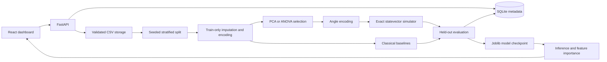

# Qura — Hybrid Quantum-Classical Biomedical Research

A working local research platform with React/TypeScript frontend, FastAPI backend, SQLite experiment storage, four classical baselines and two quantum models. The previous campus interface is preserved in src/CampusApp.tsx and its existing modules.

## Quick start

Requires Python 3.10+ and Node 20+.

```sh
npm install
python -m pip install -r backend/requirements.txt
npm run dev
```

Open http://localhost:3000. API documentation: http://localhost:5000/docs.

1. Select the bundled Wisconsin Breast Cancer dataset (569 rows, 30 features), or upload an anonymized CSV and specify its target column.
2. Configure the seed, held-out split, quantum feature reduction, qubits, layers and VQC optimization budget.
3. Select models and start an experiment. Training runs in a background worker; progress and failures appear in Experiments.
4. Compare metrics in Evaluation. Select a row to view its ROC curve and confusion matrix.
5. Inspect global permutation feature importance in Explainability.
6. Select a trained model in Predictions, load a benchmark sample or paste a JSON array with exactly the training feature columns, and run inference.
7. Export datasets, measured model results and experiment records as a JSON research report.

## Architecture



backend/main.py separates dataset validation, train-only preprocessing, background training, metrics, persistence and inference. backend/quantum.py provides simulator/model interfaces. Vite proxies /api to port 5000. The backend also serves a built dist directory when present.

## Data and methodology

Binary classification only; the lexicographically last target label is the positive class and is displayed in the UI and metrics. The benchmark maps benign to 0 and malignant to 1. Uploads require 30–10,000 rows, two classes with at least five samples each, at most 200 columns, and a 10 MB limit. File paths are server-generated UUIDs. CSV target labels cannot be missing. Do not upload names, identifiers or other patient information.

Exact duplicate rows are removed before splitting. Numerical columns use training-only median imputation and StandardScaler. Categorical columns use mode imputation and one-hot encoding with unknown-category handling. A seeded stratified holdout prevents preprocessing leakage. Duplicate counts remain visible in the source dataset summary. There is no automatic outlier clipping.

Classical models: logistic regression, probabilistic SVM, random forest and histogram gradient boosting (the equivalent baseline used instead of XGBoost). Supported estimators use balanced class weights. Gradient boosting and quantum models do not use class balancing.

Quantum kernel: RY angle encoding, ring CNOT layers, exact complex statevectors, squared state overlaps, probabilistic precomputed-kernel SVM. VQC: trainable RY layers and ring CNOT gates, qubit-0 probability, binary cross-entropy optimized by seeded COBYLA. States are normalized and calculated directly with NumPy; this is a real simulator rather than synthetic quantum scores. Qubits are bounded to 2–6 and layers to 1–4. Quantum training uses up to 160 stratified rows for practical runtime; classical models use the full training partition. This different training budget is recorded and must be considered in comparisons.

Metrics: accuracy, precision, sensitivity/recall, specificity, F1, ROC-AUC, average precision (reported as PR-AUC), confusion matrix, training seconds and inference milliseconds per sample. Feature explanations use permutation importance on up to 40 held-out rows with two repeats. This is a low-cost global diagnostic; it is not SHAP, LIME, individual attribution, or a causal explanation. Probabilities are not calibrated clinical confidence.

## API

- GET /api/health
- GET /api/datasets; GET /api/datasets/{id}
- POST /api/datasets/upload (multipart file and target)
- POST /api/preprocess (validate configuration and describe pipeline)
- POST /api/models/train (returns background experiment)
- GET /api/models
- POST /api/models/predict (model_id and samples)
- GET /api/models/{id}/metrics; GET /api/models/{id}/explain
- GET /api/experiments; GET /api/experiments/{id}

Schemas and validation are documented automatically in /docs. Failed runs retain status; interrupted runs are marked failed after restart. One training worker is allowed at a time. Storage is under backend/storage and excluded from Git. Only locally generated joblib artifacts should ever be loaded.

## Verification

```sh
npm run build
npm test
python -m pytest backend/test_platform.py -q
```

The Python integration test trains all six models, verifies probability ranges, held-out confusion counts, API validation and sample inference. Quantum unit checks cover normalization and reproducibility. Existing 28 campus tests are retained as regression coverage; they do not test the new dashboard. The new dashboard was manually checked in the browser through benchmark loading and prediction.

## Deployment

For a local production build:

```sh
npm run build
npm run dev:backend
```

Visit http://localhost:5000. A Dockerfile is supplied; build with docker build -t qura . and run with docker run -p 5000:5000 -v qura-data:/app/backend/storage qura. Container execution has not been verified in this workspace.

This version has no user authentication, tenant isolation or clinical audit controls. Keep it in a trusted local environment. Public or multi-user deployment requires authentication, access controls, TLS, upload rate limits, encrypted storage, isolated workers, retention controls and a reviewed privacy policy. There are no external quantum credentials or services configured.

## Limitations and roadmap

This is a working research MVP, not the entirety of every optional deliverable in the master brief. It currently lacks cross-validation, memory profiling, SHAP/LIME, PDF reports, a PowerPoint presentation, quantum hardware adapters and additional bundled disease benchmarks. No clinical validity or quantum advantage is claimed. The small quantum training budget and limited optimization evaluations can produce weak VQC results; use measured outcomes honestly.

Next steps: nested/cross-validated evaluation; equal-budget benchmarking; calibration and confidence intervals; independent dataset validation; authenticated multi-user storage; PennyLane/Qiskit hardware adapters; SHAP/LIME integration; advanced preprocessing; report and presentation exports. The public scikit-learn Wisconsin dataset is the demonstration source; consult the dataset's bundled description for provenance.
